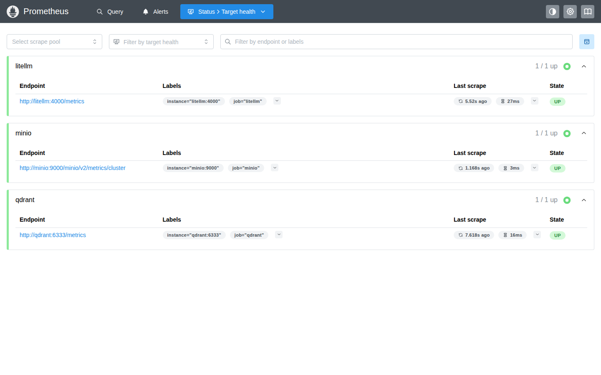
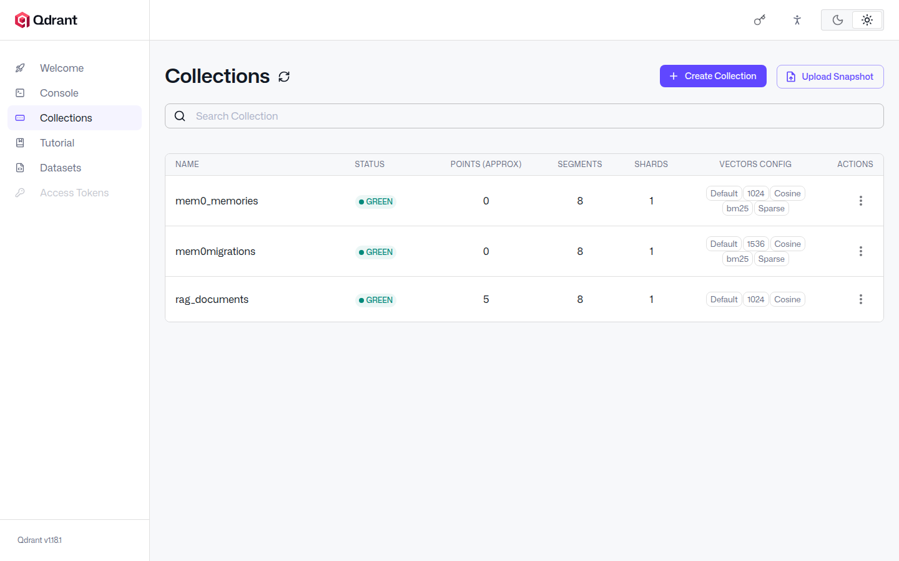
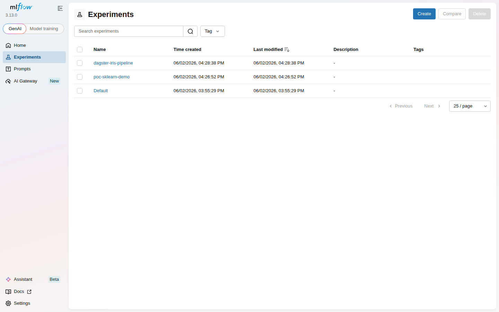
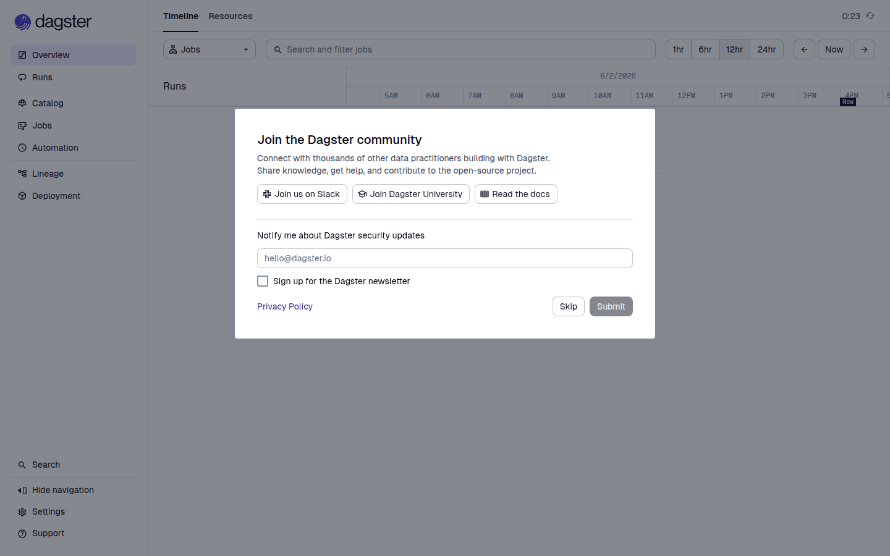
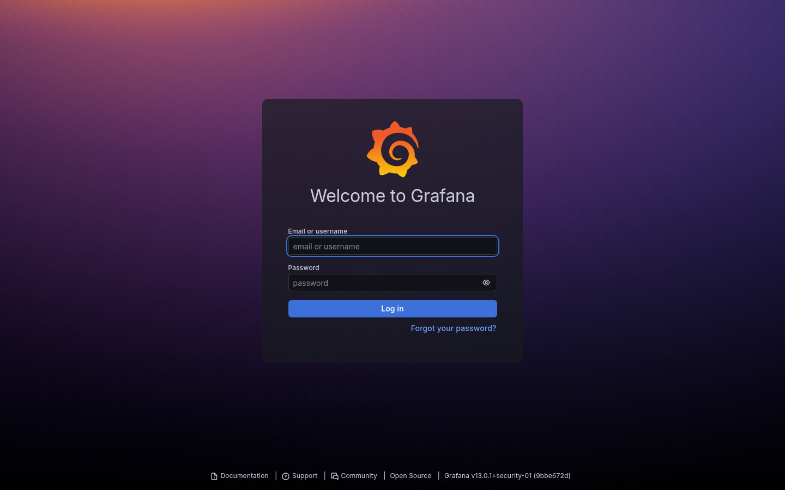
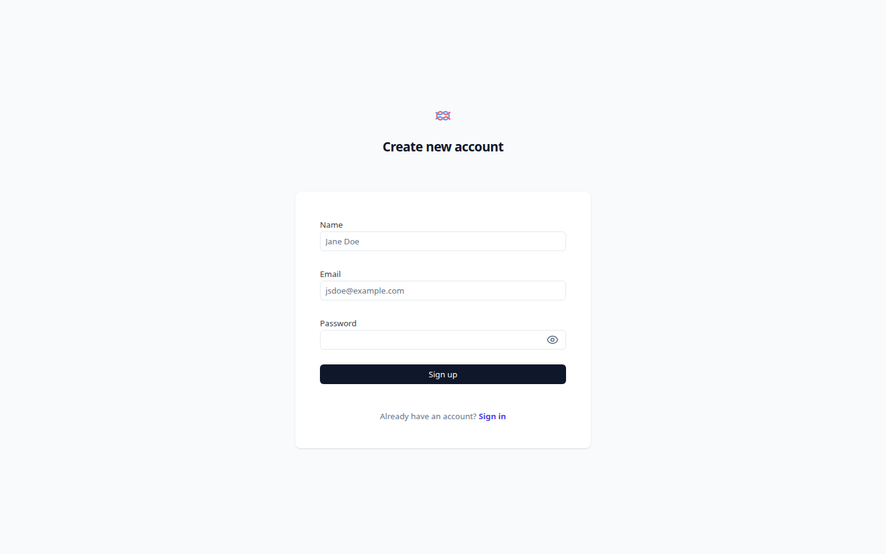

# LLMOps / AgentOps / MLOps PoC 全棧工具鏈教學

> 一站式部署 14 個服務，涵蓋 LLM 路由、可觀測性、RAG、安全護欄、Agent 編排、ML 實驗追蹤與監控告警。

---

## 目錄

- [專案概覽](#專案概覽)
- [架構總覽](#架構總覽)
- [技術原理詳解](#技術原理詳解)
- [目錄結構](#目錄結構)
- [快速開始](#快速開始)
- [設定檔詳解](#設定檔詳解)
- [腳本詳解](#腳本詳解)
- [驗證項目清單](#驗證項目清單)
- [常見問題](#常見問題)

---

## 專案概覽

### 這個專案在做什麼？

這是一個 **PoC（概念驗證）專案**，目的是在本地環境搭建一套完整的 AI 維運平台，驗證以下三大領域的工具鏈整合：

| 領域 | 全名 | 簡單解釋 |
|------|------|---------|
| **LLMOps** | Large Language Model Operations | 管理和監控大型語言模型的運維流程 |
| **AgentOps** | Agent Operations | 管理自主 AI 代理的生命週期和追蹤 |
| **MLOps** | Machine Learning Operations | 機器學習模型的訓練、部署和版本管理 |

### 為什麼需要這些？

當你把 AI 從「玩具」變成「產品」時，需要解決：
- **模型路由**：同時使用多個 LLM（本地 + 雲端），故障時自動切換
- **成本控制**：追蹤每個 API 呼叫花了多少錢
- **品質監控**：每個回答的延遲、Token 數、品質分數
- **安全防護**：防止用戶輸入敏感資料（信用卡號）、防止模型回答不當內容
- **記憶管理**：讓 AI Agent 記住跨對話的上下文
- **實驗管理**：追蹤模型訓練的每次實驗、比較結果

---

## 架構總覽

### 系統架構圖

```
使用者 (瀏覽器)
    │
    ├── Open WebUI (:3080)     ← Chat 介面
    ├── Grafana (:3001)        ← 監控 Dashboard
    ├── Langfuse (:3100)       ← LLM 追蹤介面
    └── MLflow (:5000)         ← 實驗追蹤介面
         │
         ▼
┌─── frontend-net ──────────────────────────────────────────┐
│                                                            │
│   LiteLLM Proxy (:4000)  ← 所有 LLM 請求的入口           │
│       │                                                    │
│       ├─→ 本地 Gemma 4 (:8000)   [Primary - 低延遲]       │
│       ├─→ Azure OpenAI            [Fallback - 穩定]        │
│       └─→ Anthropic Claude        [Fallback - 品質]        │
│                                                            │
├─── backend-net ───────────────────────────────────────────┤
│                                                            │
│   Langfuse        ← 追蹤每一次 LLM 呼叫                    │
│   NeMo Guardrails ← 過濾敏感資料、限制主題                  │
│   Qdrant          ← 儲存文件向量（用於 RAG）                │
│   Prometheus      ← 收集所有服務的指標                      │
│   Dagster         ← 排程執行 ML Pipeline                   │
│                                                            │
├─── data-net ──────────────────────────────────────────────┤
│                                                            │
│   PostgreSQL  ← 關聯式資料庫（存設定、使用者、實驗紀錄）      │
│   Redis       ← 快取和佇列                                 │
│   ClickHouse  ← 高速分析型資料庫（Langfuse 事件）           │
│   MinIO       ← 物件儲存（檔案、模型產物）                   │
│                                                            │
└───────────────────────────────────────────────────────────┘
```

### 三層網路隔離

| 網路層 | 用途 | 暴露方式 |
|--------|------|---------|
| `frontend-net` | 使用者可以直接存取的服務 | 綁定 `0.0.0.0`（對外開放） |
| `backend-net` | 服務之間的內部通訊 | 僅容器間可達 |
| `data-net` | 資料庫和儲存層 | 綁定 `127.0.0.1`（僅本機） |

**為什麼要分層？** 假設你的電腦在公司網路中，分層可以防止外部直接存取資料庫。即使 Open WebUI 被入侵，攻擊者也無法直接連到 PostgreSQL。

---

## 技術原理詳解

### 1. LiteLLM — AI Gateway（AI 閘道器）

**是什麼？** 一個統一的 API 代理，讓你用同一個介面呼叫不同的 LLM。

**為什麼需要？** 想像你有 3 家外送平台的帳號（Gemma、GPT、Claude），LiteLLM 就像一個統一的 App，你只需要跟它說「幫我叫外送」，它會根據規則決定用哪家平台。

**核心功能：**

```
你的應用程式
    │
    │  統一的 OpenAI 格式 API
    ▼
┌─────────────────────────────────┐
│         LiteLLM Proxy           │
│                                 │
│  ┌─────────┐  ┌──────────────┐ │
│  │ 路由引擎 │  │ Fallback 鏈  │ │
│  │         │  │              │ │
│  │ gemma → │  │ gemma 失敗？ │ │
│  │ azure → │  │ → 試 azure   │ │
│  │ claude→ │  │ → 試 claude  │ │
│  └─────────┘  └──────────────┘ │
│                                 │
│  ┌─────────────────────────┐   │
│  │ Virtual Key Management  │   │
│  │ 每個團隊一把 Key        │   │
│  │ 設定用量上限和預算       │   │
│  └─────────────────────────┘   │
└─────────────────────────────────┘
```

**Fallback 機制：** 當本地 Gemma 4 回應逾時或出錯時，LiteLLM 會自動把請求轉發給 Azure OpenAI。你的應用程式完全不需要知道這件事。

#### 更深入：路由演算法與成本計算

`router_settings.fallbacks` 是「全有全無」的鏈式 fallback；同一個 `model_name` 下定義多個 deployment 還可以做負載平衡（`routing_strategy: usage-based-routing`、`simple-shuffle`、`least-busy` 三種）。

成本是怎麼算出來的？LiteLLM 內建一份 [model price map](https://github.com/BerriAI/litellm/blob/main/model_prices_and_context_window_backup.json)，每筆請求結束後用 `(input_tokens × input_cost_per_token) + (output_tokens × output_cost_per_token)` 推算金額，再透過 `success_callback` 送到 Langfuse。本地模型成本為 0（map 裡的 `input_cost_per_token=0`），但 token 數仍會被記錄。

`callbacks: ["prometheus"]` 一開，`/metrics` 就會多出 `litellm_requests_total`、`litellm_request_duration_seconds_bucket`、`litellm_total_tokens` 等指標，Grafana 上的 LLMOps 面板就靠這幾個。

---

### 2. Langfuse — LLM 可觀測性

**是什麼？** LLM 世界的「監視器」，記錄每一次 LLM 呼叫的完整細節。

**為什麼需要？** 如果你的 AI 回答品質下降了，你需要知道：
- 是模型變慢了？（延遲分析）
- 是 Token 用太多了？（成本分析）
- 是某個 Prompt 寫壞了？（Prompt 版本管理）

**追蹤的資料：**

```
一個 Trace（追蹤）的結構：
├── Session: user-123
├── Trace: "使用者問了一個問題"
│   ├── Span: "RAG 檢索" (耗時 200ms)
│   │   └── 從 Qdrant 取得 3 篇文件
│   ├── Generation: "LLM 呼叫" (耗時 1500ms)
│   │   ├── Model: gemma-4-26b
│   │   ├── Input tokens: 856
│   │   ├── Output tokens: 234
│   │   ├── Cost: $0.0012
│   │   └── TTFT: 180ms（第一個 Token 的延遲）
│   └── Span: "Guardrails 檢查" (耗時 50ms)
│       └── Result: PASS
└── Score: faithfulness = 0.85
```

**TTFT (Time to First Token)：** 使用者按下送出後，看到第一個字出現的時間。這是最影響使用體驗的指標。

#### 更深入：Langfuse v3 為什麼要五個後端？

v2 時代 Langfuse 是單一 Postgres 應用；v3 為了支撐高吞吐量 trace ingest 拆成「Web + Worker」兩個容器，加上四種儲存：

| 儲存 | 角色 | 沒有會怎樣 |
|------|------|-----------|
| **PostgreSQL** | 設定、使用者、Prompt 版本（強一致） | 服務無法啟動（Prisma migration 跑不起來） |
| **ClickHouse** | Trace / Span / Generation 事件（千萬筆級高速分析） | 看不到任何 trace；UI 大部分頁面空白 |
| **Redis** | Web↔Worker 任務佇列、Rate Limit、Cache | Worker 收不到工作，事件卡在 Web |
| **S3 / MinIO** | 大型 payload（>1MB prompt、附件、media） | 大型 trace 截斷或丟失 |

`LANGFUSE_ENCRYPTION_KEY` 是 64 字元的 hex（`openssl rand -hex 32` 產生），用來加密 API key 等敏感欄位寫入 Postgres。一旦遺失，舊資料無法解密。

#### 更深入：v3 SDK 的 OpenTelemetry-aware API

```python
from langfuse import Langfuse
lf = Langfuse()  # 從 LANGFUSE_PUBLIC_KEY / LANGFUSE_SECRET_KEY / LANGFUSE_HOST 讀

with lf.start_as_current_span(name="rag-pipeline") as span:
    # ↓ 任何同 thread 內的 span 都自動成為這個 span 的子節點
    with lf.start_as_current_span(name="retrieve") as r:
        r.update(input={"q": question}, output=docs)
    with lf.start_as_current_generation(name="llm-call", model="gemma-4-26b") as g:
        g.update(input=prompt, output=answer, usage={"input": 856, "output": 234})

    lf.score_current_trace(name="faithfulness", value=0.85)
lf.flush()  # 程序結束前確保事件送出
```

舊 v2 的 `lf.trace(...).span(...)` / `span.end(output=...)` 在 v3 已移除——本專案的 `agents/mem0_agent.py` 與 `rag/eval_ragas.py` 就是踩到這個遷移坑的範例。

---

### 3. Qdrant — 向量資料庫

**是什麼？** 一個專門儲存和搜尋「向量」的資料庫。

**什麼是向量？** 把文字轉換成一串數字（通常 768 或 1536 個），讓電腦能理解語意相似度。

```
"人工智慧很強大" → [0.23, -0.45, 0.67, ..., 0.12]  (768 個數字)
"AI 非常厲害"    → [0.21, -0.43, 0.65, ..., 0.14]  (很接近！)
"今天天氣很好"   → [0.89, 0.12, -0.34, ..., 0.56]  (很不一樣)
```

**用途（RAG - Retrieval-Augmented Generation）：**

```
1. 文件切片：把 PDF 切成小段落
2. 向量化：每個段落 → Embedding 模型 → 向量
3. 儲存：向量 + 原文存入 Qdrant
4. 檢索：使用者問題 → 向量 → 找到最相似的段落
5. 生成：把找到的段落 + 問題一起送給 LLM
```

**為什麼不直接把整份 PDF 給 LLM？** 因為 LLM 有 Token 上限（也更貴），而且找到最相關的段落比整份文件更能產生精確的回答。

#### 更深入：HNSW 為何能在百萬向量上維持 sub-ms 檢索？

Qdrant 預設使用 **HNSW（Hierarchical Navigable Small World）** 索引——把所有向量組成多層稀疏圖，上層連結遠端鄰居（高速跳躍）、下層連結近端鄰居（精細逼近）。搜尋從最上層的入口點開始 greedy 走訪，逐層下降，每次只比較常數個鄰居。複雜度從 brute-force 的 O(N·d) 降到 O(log N · d)。

代價：HNSW 索引本身會吃掉 1.5–2× 向量本體的記憶體（圖結構）。Qdrant 提供三種壓縮抵消：

| 量化 | 縮小 | 召回率影響 | 適用場景 |
|------|------|-----------|---------|
| **Scalar (int8)** | 4× | <1% | 大多數場景的安全預設 |
| **Product (PQ)** | 16–64× | 1–5% | 超大語料 / 記憶體有限 |
| **Binary** | 32× | 視資料而定 | 需先 rerank 才實用 |

#### 更深入：選哪一種距離度量？

| 距離 | 公式直覺 | 用在 |
|------|---------|------|
| **Cosine**（本專案） | 兩向量夾角 | OpenAI / sentence-transformers 多數模型 |
| **Dot product** | Cosine × magnitudes | 已正規化 + 想保留 magnitude 訊號 |
| **Euclidean** | 兩點直線距離 | 影像 / 數值特徵，較少用於文字 |

選錯距離，模型在訓練時學到的「相似」就不再對應到資料庫的「相近」——召回率可能掉到隨機水準。

#### 更深入：Hybrid Search（為什麼純向量不夠）

純語意搜尋對「精確關鍵字」（產品型號、人名、版本號）表現很弱。生產 RAG 多半把 BM25/keyword 結果與向量結果加權合併（RRF, Reciprocal Rank Fusion）。Qdrant 從 1.10 起支援 sparse vector + dense vector 在同一個 collection 內共存查詢。

---

### 4. NeMo Guardrails — 安全護欄

**是什麼？** NVIDIA 開發的安全框架，在 LLM 的輸入和輸出端加上「過濾器」。

**兩種模式：**

```
模式 A：應用層攔截（攔截在前）
┌──────────────┐    ┌───────────────┐    ┌─────────┐
│ 使用者輸入    │ →  │ Guardrails    │ →  │ LiteLLM │
│ "我的信用卡是 │    │ 偵測到 PII！   │    │ (不會到) │
│  4111-..."   │    │ → 攔截 + 拒絕  │    └─────────┘
└──────────────┘    └───────────────┘

模式 B：LiteLLM Hook（攔截在後）
┌──────────────┐    ┌─────────┐    ┌───────────────┐
│ 使用者問：    │ →  │ LiteLLM │ →  │ Guardrails    │
│ "怎麼做炸彈" │    │ 產生回答  │    │ 偵測到違規！   │
└──────────────┘    └─────────┘    │ → 攔截回答     │
                                    └───────────────┘
```

**PII（個人識別資訊）：** 信用卡號、身分證號、社會安全碼等。Guardrails 會偵測這些模式並阻止處理。

#### 更深入：Colang —— 給對話流程的 DSL

NeMo 用一個叫 **Colang** 的 DSL 描述 rails，分為 1.0（YAML 風格）與 2.0（類 Python）。本專案 pin `colang_version: "1.0"`：

```colang
# configs/guardrails/rails/pii.co
define user contains pii
  "My credit card number is 4111-1111-1111-1111"  # ← few-shot 範例，用語意比對
  "My ID number is A123456789"

define flow pii filter input          # ← 流程
  user contains pii                   # ← 條件
  bot refuse pii                      # ← 動作（呼叫下面定義的 bot intent）
  stop                                # ← 不要繼續送給 LLM

define bot refuse pii
  "我偵測到敏感資訊，請移除後再試。"
```

執行期：使用者輸入 → embedding → 與所有 `define user ...` 範例比語意相似度 → 落在哪個 intent → 觸發對應 flow。

#### 更深入：四種 Rail 層級

| Rail | 攔截點 | 例子 |
|------|--------|------|
| **input rails** | LLM 收到前 | PII 偵測、jailbreak 偵測 |
| **dialog rails** | LLM 推論過程 | 強制走特定話術、轉接人工 |
| **output rails** | LLM 回應後 | 拒答話題、自我審查、敏感字過濾 |
| **retrieval rails** | RAG 取回後 | 過濾不該被引用的文件 |

「防禦縱深」的精神：input 擋 90%，output 擋 9%，dialog/retrieval 擋剩下 1%。單一層永遠會被繞過。

#### 更深入：為什麼不直接靠 system prompt？

System prompt 是「軟」約束，使用者只要 jailbreak（角色扮演、提示注入）就可能繞過。Guardrails 是「硬」約束——攔截在 LLM 之外的獨立流程，使用者根本看不到也碰不到。兩者搭配才完整。

---

### 5. LangGraph — Agent 框架

**是什麼？** LangChain 生態的 Agent 編排框架，用「有向圖」來定義 AI Agent 的行為流程。

**什麼是 Agent？** 一個能自主決定下一步行動的 AI。不只是「問問題→得到回答」，而是「分析問題→決定用什麼工具→執行→看結果→決定下一步」。

**ReAct 模式（Reasoning + Acting）：**

```
使用者："144 的平方根加上今年是幾年？"

Agent 思考流程：
├── Step 1: 我需要計算 √144
│   └── 呼叫 calculator 工具 → 12
├── Step 2: 我需要知道今年
│   └── 呼叫 get_current_time 工具 → 2026
├── Step 3: 12 + 2026 = 2038
└── Final: "144 的平方根是 12，加上今年 2026 等於 2038"
```

**Human-in-the-Loop（人機協作）：**

```
Agent 執行流程：
├── research: LLM 產生行動計劃
├── human_review: ⏸️ 暫停！等待人工確認
│   └── 人類審查計劃 → "approve" / "reject"
└── execute: 獲得批准後繼續執行
```

這在高風險場景很重要：例如 Agent 要發送郵件或修改資料庫時，先讓人確認。

#### 更深入：StateGraph 的核心模型

LangGraph 把 Agent 抽象成「狀態 + 圖」：

```python
class AgentState(TypedDict):
    messages: Annotated[list[AnyMessage], operator.add]   # ← 累積策略：append
    # 不寫 Annotated 的欄位則是「覆蓋策略」
```

每個 node 是一個 `State -> dict` 的 pure function，回傳要更新的欄位。Annotated 的 reducer 決定怎麼合併（add、replace、custom merge）。這比 LangChain 0.1 時代的 `AgentExecutor` + `MessagesPlaceholder` 大量隱式狀態好除錯非常多——所有狀態變動都看得到、都可重播。

#### 更深入：Checkpointing —— Agent 為什麼能「暫停」

`MemorySaver` 只是 in-process dict；正式環境用 `PostgresSaver` 或 `SqliteSaver`。每執行一個 node，graph 把 (thread_id, checkpoint_id, state, next_nodes) 寫入 checkpointer。HITL 的 `interrupt()` 把 graph 凍結在某個 node，狀態落地到 checkpointer；外部呼叫 `graph.stream(Command(resume=...))` 就從那個檢查點接續執行——重啟程序也不會丟。

#### 更深入：四種 stream 模式

| stream_mode | 拿到什麼 | 適合 |
|-------------|---------|------|
| `values` | 完整 state 快照 | 想看整體狀態演進 |
| `updates`（本專案常用） | 每個 node 的部分更新 | UI 即時顯示「Agent 在做什麼」 |
| `messages` | LLM token-by-token 流 | 對話 UI 的打字機效果 |
| `debug` | 內部事件（含 reducer 細節） | 除錯 |

---

### 6. Mem0 — Agent 記憶管理

**是什麼？** 讓 AI Agent 擁有跨對話的長期記憶。

**為什麼需要？** 普通的 ChatGPT 對話結束後就忘記了。但如果你的 AI 助理需要記住「用戶偏好的程式語言」、「上次討論到的專案進度」，就需要 Mem0。

```
對話 1（今天）：
  使用者："我叫 Alice，在 TechCorp 工作"
  → Mem0 儲存到 Qdrant: {user: alice, fact: "works at TechCorp"}

對話 2（下週）：
  使用者："我在哪裡工作？"
  → Mem0 從 Qdrant 搜尋 user=alice 的記憶
  → 找到: "works at TechCorp"
  → Agent: "你在 TechCorp 工作"
```

---

### 7. MLflow — 實驗追蹤與模型管理

**是什麼？** ML 界的「實驗筆記本」+ 「模型倉庫」。

**為什麼需要？** 訓練模型時你會嘗試不同的超參數：

```
實驗 1: n_estimators=100, max_depth=5  → accuracy=0.92
實驗 2: n_estimators=200, max_depth=10 → accuracy=0.95  ← 最好！
實驗 3: n_estimators=300, max_depth=15 → accuracy=0.93  (過擬合)
```

MLflow 自動記錄這些，讓你比較和重現結果。

**Model Registry（模型註冊表）：**

```
iris-classifier
├── Version 1 → Stage: Archived（舊版）
├── Version 2 → Stage: Staging（測試中）
└── Version 3 → Stage: Production（正式上線）
```

#### 更深入：Stages 已過時，改用 Aliases

MLflow 2.9 起 stages（Staging/Production）被標記 deprecated，3.x 直接移除。新模型是 **Alias**——一個可改名的指標：

```python
client.set_registered_model_alias("iris-classifier", alias="staging",    version=4)
client.set_registered_model_alias("iris-classifier", alias="production", version=3)
# 載入時用 alias 引用：
model = mlflow.sklearn.load_model("models:/iris-classifier@production")
```

Alias 是 **指標**（mutable pointer），同一個 version 可以同時被多個 alias 指——例如同時是 `production` 與 `champion`。本專案 `mlops/mlflow_experiment.py` 就是改用 alias 寫的。

#### 更深入：Backend / Artifact / Registry 三層

| 層 | 存什麼 | 本專案怎麼存 |
|----|--------|------------|
| **Tracking backend** | runs、params、metrics、tags（小資料） | Postgres（`--backend-store-uri postgresql://...`） |
| **Artifact store** | 模型成品、圖檔、CSV（大資料） | 容器內 volume `/mlflow/artifacts`（正式環境改用 S3/MinIO） |
| **Model registry** | RegisteredModel + Version + Alias | 共用 Tracking backend 的 Postgres |

注意 `ghcr.io/mlflow/mlflow` 原始映像 **不含 psycopg2**——直接用 `--backend-store-uri postgresql://` 會炸。本專案的 `configs/mlflow/Dockerfile` 就為了塞 `psycopg2-binary` 而存在。

---

### 8. Dagster — 管線編排

**是什麼？** 一個現代化的工作流程排程引擎。

**為什麼需要？** ML 工作流程有明確的步驟順序：

```
┌──────────┐    ┌────────────────┐    ┌──────────────┐
│ raw_data │ →  │ feature_engin. │ →  │ model_eval   │
│ 載入資料  │    │ 特徵工程        │    │ 訓練＋評估    │
└──────────┘    └────────────────┘    └──────────────┘
                                            │
                                            ▼
                                      ┌──────────┐
                                      │ MLflow   │
                                      │ 記錄結果  │
                                      └──────────┘
```

Dagster 確保：步驟按順序執行、失敗時重試、可以排程（每天凌晨跑一次）。

#### 更深入：Software-Defined Assets vs 任務 DAG

Airflow 把世界看成「任務」：「11:00 跑 SQL」「12:00 跑 Python」——你寫的是動作。
Dagster 把世界看成「**資產**」：「`customer_features` 表是 `raw_events` 表透過 group-by 推得」——你寫的是依賴。

```python
@asset
def raw_data(context) -> pd.DataFrame: ...           # ← 我產生 raw_data

@asset
def feature_engineered_data(raw_data) -> pd.DataFrame:  # ← 我需要 raw_data
    return raw_data.assign(...)
```

Dagster 從函式簽名自動推出 DAG，不用手寫 `set_upstream`。Web UI 顯示的也是「資產之間的依賴圖」，而非「任務的時間表」——對 ML/RAG/Data 工作流程更直觀。

#### 更深入：Materialize、Backfill、Sensor

| 動作 | 意思 |
|------|------|
| **Materialize** | 跑一次 asset 的計算，把結果寫進它的 storage |
| **Backfill** | 對「歷史分區」批次 materialize（例如「重跑過去 30 天的每日 asset」） |
| **Sensor** | 偵測外部事件（檔案落地、S3 物件、Kafka 訊息）自動觸發 |
| **Schedule** | 純時間觸發（cron） |

#### 更深入：dagster.yaml 與工作區掛載

Dagster 容器啟動時需要：

1. **`DAGSTER_HOME`**：實例設定根目錄（本專案 `/opt/dagster/dagster_home`）。
2. **`dagster.yaml`**：定義儲存後端（runs/events/schedules → Postgres 還是 SQLite）。沒設 → 預設用 ephemeral SQLite，重啟全丟。
3. **`workspace.yaml`**：告訴 webserver/daemon 去哪載入 `@asset` 函式。

本專案 mount `./mlops:/opt/dagster/app`，並在 `configs/dagster/dagster.yaml` 指定 Postgres 後端。

---

### 9. Prometheus + Grafana — 監控告警

**Prometheus** 是什麼？一個時間序列資料庫，每 15 秒去「抓」各服務的指標。

**Grafana** 是什麼？把 Prometheus 的數據畫成圖表的工具。

```
LiteLLM (:4000/metrics)
    │ 每 15 秒
    ▼
Prometheus (儲存指標)
    │
    ▼
Grafana (視覺化)
    ├── 總請求數
    ├── 平均延遲
    ├── 錯誤率
    ├── Token 消耗
    └── Fallback 觸發次數
```

#### 更深入：Pull 模型 vs Push 模型

Prometheus 走 **Pull** 模型——它主動去每個 target 抓 `/metrics`。優點：

- Target 不知道 Prometheus 存在，零配置即可被監控
- Target 死掉 → 抓不到 → 自動產生 `up == 0` 告警
- 重啟 Prometheus 不會掉資料（reset 在 scraper 而非 emitter）

對比 push（StatsD/Datadog Agent）：需要每個 service 主動發送，service 自己要管 retry/buffer/backpressure。但 push 適合短命任務（batch job 跑完就退出，沒人來 pull）—— Prometheus 的解法是 **Pushgateway**。

#### 更深入：PromQL 三個必懂的函式

```promql
# 1. rate(): 把 counter 變成「每秒增量」
rate(litellm_requests_total[5m])

# 2. histogram_quantile(): 從 *_bucket 估算 p95 / p99 延遲
histogram_quantile(0.95, rate(litellm_request_duration_seconds_bucket[5m]))

# 3. sum by(): 按標籤聚合（如按模型分組）
sum by(model) (rate(litellm_requests_total[5m]))
```

本專案 `configs/grafana/dashboards/llmops-overview.json` 主要就靠這三個函式。

#### 更深入：Grafana datasource UID 必須對齊

Dashboard JSON 裡每個 panel 都用 `"datasource": {"uid": "prometheus"}` 引用資料源；如果 `configs/grafana/provisioning/datasources/datasource.yml` 沒明確指定 `uid: prometheus`，Grafana 會給隨機 UID，整張 dashboard 就會「找不到資料源」——這是本 PoC 的 H1 修復項。

---

### 10. 支援元件

| 元件 | 角色 | 簡單比喻 |
|------|------|---------|
| **PostgreSQL** | 關聯式資料庫 | Excel 試算表（有欄位、有關聯） |
| **Redis** | 快取 / 佇列 | 便利貼（快速暫存常用資料） |
| **ClickHouse** | 分析型資料庫 | 大量日誌的高速搜尋引擎 |
| **MinIO** | 物件儲存 | 自建的 Google Drive（存檔案） |

---

### 11. 實作踩雷紀錄（v3 遷移與 Docker 陷阱）

把整套堆疊真的跑起來時會撞到的問題，這裡先講。每一條都是本 PoC commit history 裡的真實修復項：

#### A. Langfuse v2 → v3 SDK 三種 API 並存陷阱

`langfuse>=2.50.0` 這個 pin 範圍會解析出 v4，但 v3、v4 都有 breaking change。三段程式碼用三種寫法，混在一起時保證至少有一邊壞：

```python
# v2 (deprecated)
lf.trace(name="x").span(name="y").end(output=...)
from langfuse.callback import CallbackHandler

# v3+
with lf.start_as_current_span(name="y") as s: s.update(output=...)
from langfuse.langchain import CallbackHandler
```

**修復**：pin `langfuse>=3,<4`，全面改寫 v2 風格的呼叫。

#### B. NVIDIA NeMo Guardrails 沒有公開 Docker 映像

`nvcr.io/nvidia/nemo-guardrails:latest` 並不存在於 NGC——`docker compose pull` 直接失敗。
**修復**：用 `configs/nemo-guardrails/Dockerfile` 自己從 pip 包 build。注意要裝 `nemoguardrails[server]` extra（FastAPI/uvicorn 不在預設 deps），且 `annoy` 套件需要 `build-essential` + `python3-dev` 才能編譯。

#### C. slim Python 映像沒有 wget／curl

`python:3.11-slim` 系列（LiteLLM、MLflow、NeMo Guardrails、Dagster 都基於它）連 wget 都沒有。Compose 上常見的：
```yaml
healthcheck:
  test: ["CMD", "wget", "--spider", "http://localhost:4000/health"]
```
都會直接 `wget: not found`。**修復**：改用 bash 內建 `/dev/tcp/`：
```yaml
test: ["CMD-SHELL", "bash -c '</dev/tcp/localhost/4000' >/dev/null 2>&1 || exit 1"]
```

#### D. Next.js standalone 不綁 loopback

Langfuse v3 是 Next.js 16 standalone，預設只綁容器 eth0 IP（log 顯示 `http://<容器ID>:3000`），**不**綁 `127.0.0.1` / `localhost`。容器內部 `wget http://localhost:3000` → connection refused。
**修復**：healthcheck 用 `$HOSTNAME`（容器 ID，會經 `/etc/hosts` 解析到 eth0 IP）：
```yaml
test: ["CMD-SHELL", "wget --spider http://$$HOSTNAME:3000/api/public/health || exit 1"]
```

#### E. MLflow 官方映像沒有 psycopg2

`ghcr.io/mlflow/mlflow:latest` 不附 `psycopg2-binary`，但 `--backend-store-uri postgresql://...` 又一定要它。
**修復**：自建映像加 `pip install psycopg2-binary`（見 `configs/mlflow/Dockerfile`）。

#### F. Dagster webserver/daemon 啟動時是「空殼」

官方 `dagster/dagster-webserver` 映像只有 dagster 本身，沒有你的 `@asset` 程式碼，也沒有 `dagster.yaml`（→ 預設用 ephemeral SQLite，重啟全丟）。
**修復**：

- 自建映像安裝 `dagster-postgres` + 你的 ML 依賴（pandas/sklearn/mlflow）
- mount `./mlops:/opt/dagster/app`
- 提供 `configs/dagster/dagster.yaml`（Postgres 儲存）
- `command:` 顯式指定 `--workspace`

#### G. Open WebUI 沒給 OPENAI_API_KEY 會 401

Open WebUI 透過 OpenAI-compatible client 呼叫 LiteLLM，但 LiteLLM 啟用了 `master_key`。
**修復**：在 compose `environment:` 加 `OPENAI_API_KEY: ${LITELLM_MASTER_KEY}`。

#### H. env_file 不會展開 ${VAR}

Docker Compose 對 `env_file:` 載入的檔案 **不做變數替換**——`.env` 裡寫 `GUARDRAILS_LLM_API_KEY=${LITELLM_MASTER_KEY}` 會原樣以字串 `"${LITELLM_MASTER_KEY}"` 注入容器。
**修復**：把這種「引用他變數」的條目搬到 compose YAML 的 `environment:` 區塊，那裡才有 substitution。

#### I. MinIO 預設要 Bearer Token

`/minio/v2/metrics/cluster` 預設要授權；Prometheus 不會自動帶 token，scrape 直接 401。
**修復**：在 minio 服務環境加 `MINIO_PROMETHEUS_AUTH_TYPE: public`。

#### J. Qdrant client.query(query_text=…) 需要 fastembed extra

舊版示範常用 `client.query(query_text=...)`——這是 fastembed 路徑，需要 `pip install qdrant-client[fastembed]`，且 collection 是用 `client.add()` 建立。一般 collection 應該用 `client.query_points(query=<vector>, ...)` 並讀 `point.payload`（不是 `point.metadata`）。

> 上面這些不是 framework 的「bug」，都是「README/官方文件沒講清楚」的營運摩擦。本專案的價值之一，就是把這些坑都填好之後留下可重現的設定。

---

## 目錄結構

```
ml-llm-agent-ops-tutorial/
│
├── ADR-001-LLMOps-AgentOps-MLOps-PoC-Plan.md  # 架構決策文件
├── docker-compose.yml                          # 14 個服務的部署定義
├── .env.example                                # 環境變數範本
├── .gitignore                                  # Git 排除規則
├── requirements.txt                            # Python 依賴套件
│
├── configs/                                    # 所有服務的設定檔
│   ├── litellm/
│   │   └── config.yaml                         # LLM 路由 + Fallback 設定
│   ├── postgres/
│   │   └── init-databases.sh                   # 資料庫初始化腳本
│   ├── prometheus/
│   │   └── prometheus.yml                      # 指標收集目標
│   ├── grafana/
│   │   ├── dashboards/
│   │   │   └── llmops-overview.json            # LLMOps 監控面板
│   │   └── provisioning/
│   │       ├── datasources/datasource.yml      # 資料來源設定
│   │       └── dashboards/dashboard.yml        # Dashboard 載入設定
│   └── guardrails/
│       ├── config.yml                          # Guardrails 主設定
│       ├── prompts.yml                         # 安全檢查 Prompt
│       └── rails/
│           ├── pii.co                          # PII 過濾規則
│           └── topic.co                        # 主題限制規則
│
├── agents/                                     # AI Agent 範例
│   ├── react_agent.py                          # ReAct 多步驟推論 Agent
│   ├── hitl_agent.py                           # Human-in-the-Loop Agent
│   ├── rag_agent.py                            # RAG + Guardrails 全鏈路 Agent
│   └── mem0_agent.py                           # 跨對話記憶管理
│
├── rag/                                        # RAG Pipeline
│   ├── rag_pipeline.py                         # 端到端 RAG 流程
│   └── eval_ragas.py                           # RAG 品質評估
│
├── mlops/                                      # MLOps 工具
│   ├── mlflow_experiment.py                    # MLflow 實驗追蹤
│   ├── dagster_pipeline.py                     # Dagster 管線編排
│   └── workspace.yaml                          # Dagster 工作區設定
│
└── scripts/                                    # 工具腳本
    ├── seed_qdrant.py                          # Qdrant 向量資料庫初始化
    └── test_integration.py                     # 25 項驗證自動化測試
```

---

## 快速開始

### 前置需求

| 項目 | 最低要求 |
|------|---------|
| Docker + Docker Compose | v24+ |
| Python | 3.11+ |
| 本地推論主機 | Apple Silicon Mac（OMLX）**或** Linux + GPU（vLLM/Ollama） |
| LLM 記憶體 | 16 GB VRAM 或 16 GB 統一記憶體（跑 Gemma 4 26B 4-bit） |
| RAM | 64 GB（含 14 個 Docker 服務） |
| Disk | 50 GB+ SSD |

### 步驟

```bash
# 1. Clone 專案
git clone https://github.com/ChunPingWang/mlops-llmops-agentops-tutorial.git
cd mlops-llmops-agentops-tutorial

# 2. 設定環境變數
cp .env.example .env
# 編輯 .env，填入你的 API Key（Azure、Anthropic）

# 3. 啟動本地推論服務（chat + embedding）
#    → 見下方「本地推論伺服器（OMLX / vLLM）」章節
#    Mac 用 OMLX；Linux+GPU 用 vLLM。chat 和 embedding 都要備齊。

# 4. 啟動全棧服務
docker compose up -d

# 5. 確認健康狀態
docker compose ps

# 6. 安裝 Python 依賴（跑腳本用）
python -m venv venv
source venv/bin/activate
pip install -r requirements.txt

# 7. 初始化向量資料庫
python scripts/seed_qdrant.py

# 8. 執行整合測試
python scripts/test_integration.py
```

### 服務存取

| 服務 | URL | 用途 |
|------|-----|------|
| Open WebUI | http://localhost:3080 | Chat 介面 |
| LiteLLM | http://localhost:4000/ui | API Gateway 管理 |
| Langfuse | http://localhost:3100 | LLM 追蹤 |
| MLflow | http://localhost:5000 | 實驗追蹤 |
| Dagster | http://localhost:3070 | 管線排程 |
| Grafana | http://localhost:3001 | 監控 Dashboard |
| Qdrant | http://localhost:6333/dashboard | 向量 DB 管理 |

---

## 本地推論伺服器（OMLX / vLLM）

LiteLLM 本身不做推論——它只是把請求轉發給「真正的模型伺服器」。Docker stack 啟動前，這個 chat + embedding 端點必須先準備好。本專案在 macOS 上以 [OMLX (mlx-omni-server)](https://github.com/madroidmaq/mlx-omni-server) 為主，在 Linux + GPU 上以 vLLM 為主，兩者都提供 OpenAI-compatible API。

### A. macOS（Apple Silicon）— OMLX 路線

OMLX = `mlx-omni-server`，把 Apple 的 MLX runtime 包成 OpenAI-compatible API。一個 process 同時提供 `/v1/chat/completions` 與 `/v1/embeddings`。

#### A.1 安裝 + 啟動 chat

> **macOS Python 3.12+（PEP 668）注意**：直接 `pip install` 會拿到
> `error: externally-managed-environment`。下面三選一即可：
>
> | 方式 | 指令 | 適合 |
> |------|------|------|
> | **`uv`（推薦）** | `brew install uv && uv tool install mlx-omni-server --with mlx-embeddings` | 想要 isolated env 又有系統級 CLI |
> | **`pipx`** | `brew install pipx && pipx install mlx-omni-server && pipx inject mlx-omni-server mlx-embeddings` | 跟 uv 等價的老牌方案 |
> | **venv** | `python3 -m venv ~/.venvs/omlx && source ~/.venvs/omlx/bin/activate && pip install -U mlx-omni-server mlx-embeddings` | 不想多裝工具，但每次開 shell 要 `source` |
>
> **不要用** `pip install --break-system-packages`：違反 PEP 668 設計、brew 升級 Python 時會壞掉。
>
> **`uv tool install` 的關鍵**：`--with mlx-embeddings` 把 embedding 套件裝進**同一個** venv，這樣 `mlx-omni-server` import 才到（A.2 那條 router 才會掛起來）。pipx 用 `inject` 也是同樣道理。

```bash
# 用 uv 一次裝齊（chat 與 embedding 共用同一個 isolated env）
brew install uv
uv tool install mlx-omni-server --with mlx-embeddings

# 預先 pull 一個 chat 模型（不下也行，首次請求會自動下載）
huggingface-cli download mlx-community/gemma-4-26b-a4b-it-4bit

# 啟動 server（綁 0.0.0.0 才能讓其他機器存取）
mlx-omni-server --host 0.0.0.0 --port 8000

# 測試
curl http://127.0.0.1:8000/v1/models | jq '.data[].id'
```

OMLX 預設不要求 API key；要啟用 bearer 鑑權的話傳 `--api-keys VMware1!` 即可。**本專案的 `.env` 預設 `OMLX_API_KEY=VMware1!`，記得對齊。**

#### A.2 加入 embedding 模型（V-09/V-11/V-19 必須）

mlx-omni-server **支援** `/v1/embeddings`，但 router 只在 `mlx-embeddings` 套件可 import 時才會自動掛載。如果你直接 `curl /v1/embeddings` 拿到 404，就是這個原因：

```bash
# 1. 升級 server 並補上 embeddings 套件
#    （如果 A.1 已用 uv tool install ... --with mlx-embeddings，這步可跳過）
uv tool install --upgrade mlx-omni-server --with mlx-embeddings
# pipx 版本: pipx upgrade mlx-omni-server && pipx inject mlx-omni-server mlx-embeddings --force
# venv 版本: source ~/.venvs/omlx/bin/activate && pip install -U mlx-omni-server mlx-embeddings

# 2. 預先 pull 一個 embedding 模型
huggingface-cli download mlx-community/mxbai-embed-large-v1

# 3. 重啟 server（不必加 --model 等 flag；router 看到套件就自動掛載）
pkill -f mlx-omni-server 2>/dev/null
MLX_OMNI_LOG_LEVEL=debug mlx-omni-server --host 0.0.0.0 --port 8000

# 4. 驗證 embedding 端點（從另一台機器跑也行）
curl -sS http://10.0.0.3:8000/v1/embeddings \
  -H "Authorization: Bearer VMware1!" \
  -H "Content-Type: application/json" \
  -d '{"model":"mlx-community/mxbai-embed-large-v1","input":"hello"}' \
  | jq '.data[0].embedding | length'
# 預期印出: 1024
```

既有的 chat 模型不會被卸載——OMLX 對每個 model 各自 in-process cache。

#### A.3 embedding 模型建議三選一

| HF 模型 ID | 維度 | 大小 | 適合 |
|---|---|---|---|
| `mlx-community/mxbai-embed-large-v1` | **1024** | ~670 MB | RAG 預設選擇，品質 / 速度平衡 |
| `mlx-community/all-MiniLM-L6-v2-4bit` | **384** | ~13 MB | 最快、最小 |
| `mlx-community/bge-m3-mlx-fp16` | **1024** | ~2.2 GB | 多語言、長 context（8 192 tokens） |

選完之後在 `.env` 設 `EMBEDDING_MODEL=<id>`，並把 `scripts/seed_qdrant.py` 的 `VECTOR_SIZE` 對齊到該模型維度（**1024** 或 **384**）。

#### A.4 退路：embeddings 仍 404 時，跑獨立 server

如果升級完還是 404（代表這個 build 的 router 真沒掛起來），用 `mlx-embeddings` 本身的 server 跑在另一個 port：

```bash
pip install -U mlx-embeddings
python -m mlx_embeddings.server --host 0.0.0.0 --port 8001 \
  --model mlx-community/mxbai-embed-large-v1
```

然後在 `configs/litellm/config.yaml` 把 `text-embedding` 模型的 `api_base` 改指 `http://10.0.0.3:8001/v1`，chat 維持 `:8000`。

### B. Linux + GPU — vLLM 路線

```bash
pip install vllm sentence-transformers
# Chat
vllm serve mlx-community/gemma-4-26b-a4b-it-4bit --port 8000 &
# Embedding（另一個 process / 另一個 port 比較乾淨）
vllm serve BAAI/bge-large-en-v1.5 --port 8001 --task embed &
```

兩個 port 都 OpenAI-compatible；`.env` 設兩個 BASE_URL 即可：
```bash
LOCAL_LLM_BASE_URL=http://127.0.0.1:8000/v1     # chat
EMBEDDING_BASE_URL=http://127.0.0.1:8001/v1     # embeddings
```

### C. 對齊 `.env` 與 LiteLLM config

無論 A 或 B，本專案都靠這些變數把外部 endpoint 灌進 LiteLLM 容器：

```bash
# .env
LOCAL_LLM_BASE_URL=http://10.0.0.3:8000/v1        # OMLX / vLLM chat
LOCAL_LLM_MODEL=gemma-4-26b-a4b-it-4bit
OMLX_API_KEY=VMware1!                              # 若 server 啟 bearer
EMBEDDING_MODEL=mlx-community/mxbai-embed-large-v1 # 選好的 embedding id
```

`configs/litellm/config.yaml` 已經把 chat（`gemma-4-26b`）和 embedding（`text-embedding`）兩個邏輯模型都接到同一個 `LOCAL_LLM_BASE_URL`；如果你走 B 把 embedding 拆到另一個 port，把那一段的 `api_base` 改成獨立環境變數即可。

> **記得：** 改完 `.env` 後 `docker compose up -d --no-deps --force-recreate litellm`，讓 proxy 重新讀。

### D. 為什麼這個驗證流程需要上面這些設定？

每個設定都對應一個會壞掉的環節。讀者照抄指令前，知道下面這條因果鏈會少踩很多坑：

| 設定 | 不做會發生什麼 | 為什麼 |
|------|---------------|--------|
| **`pip install mlx-embeddings`** | `/v1/embeddings` 回 **404**，所有 RAG/Mem0 驗證（V-09/V-11/V-19）整段斷線 | mlx-omni-server 採「optional dependency」設計，embeddings router 只在啟動時能 `import mlx_embeddings` 才會掛載；缺套件就靜默跳過，FastAPI 路由表裡根本沒有這個 URL |
| **預先 `huggingface-cli download`** | 第一次請求要等下載（幾百 MB 到幾 GB），測試 timeout 失敗，誤判成「服務壞掉」 | mlx-omni-server 是 lazy-load，模型不在 `~/.cache/huggingface` 就會即時下載；預 pull 把這個延遲移到「設定時」而非「測試時」 |
| **server 綁 `--host 0.0.0.0`** | 從別台機器（如跑 Docker stack 的 Linux 主機）連會 `connection refused` | 預設只綁 `127.0.0.1`，外部請求 ARP 得到主機後 TCP 連不到 service。Mac 跟 Docker 主機是同一台時這條可以省略，跨機器則必開 |
| **bearer token（`OMLX_API_KEY`）對齊** | LiteLLM 拿到上游 **401**，所有 chat 與 embedding 都失敗 | OMLX 啟用 `--api-keys` 後會驗 `Authorization: Bearer <key>`；LiteLLM 用 `configs/litellm/config.yaml` 的 `api_key: "os.environ/OMLX_API_KEY"` 從容器環境讀值；`.env` 沒設或字串不一致就一路 401 |
| **`EMBEDDING_MODEL` 設成完整 HF id** | LiteLLM 路由失敗：`Bad model id` 或 OMLX 端 404 | LiteLLM `model_list` 裡 `text-embedding` 的 `model:` 欄位（去前綴 `openai/`）會原封不動轉發給上游；OMLX 接 OpenAI API 規範，model 欄位必須是它認識的 HF id（短名 `text-embedding-3-small` 不會自動 resolve） |
| **`VECTOR_SIZE` 對齊模型維度** | `scripts/seed_qdrant.py` upsert 時 Qdrant 回 **400 dimension mismatch** | Qdrant collection 建立時就**固定**向量維度；之後 upsert 的每個 vector 長度必須完全相符。`mxbai-embed-large-v1` 是 1024、`MiniLM-L6` 是 384，跑錯 collection 整個 RAG 就索引不進去 |
| **改 `.env` 後重啟 LiteLLM** | LiteLLM 還拿著舊的 base_url / api_key，新請求一律打到舊位置 | LiteLLM proxy 啟動時把 `os.environ/...` 解析成具體字串放進 process memory；之後改 `.env` 並不會 hot-reload。`docker compose up -d --no-deps --force-recreate litellm` 重啟容器 = 重讀 env |
| **chat 與 embedding 共用同一個 port（A 方案）** | 兩個 server 一個 process，記憶體有可能擠爆統一記憶體（Apple Silicon） | 同一個 OMLX 同時 cache 26B chat 模型（~16 GB）+ embedding 模型（~700 MB），24 GB 統一記憶體勉強夠；32 GB 以上才舒服。若 RAM 緊張，用 A.4 退路把 embedding 拆到 `:8001` 並用較小模型 |
| **重建 Qdrant collection（`recreate_collection=True`）** | 舊維度 / 舊資料殘留，新 upsert 跟舊向量混在一起無法檢索 | 換 embedding 模型 = 換維度 = 必須丟掉舊 collection。`seed_qdrant.py` 預設就 force-recreate，但 production 場景要小心：這會 **truncate** 原本所有資料 |

#### 「為什麼 V-09/V-11/V-19 一定要 embedding？」

| V-item | 流程 | 為何要 embedding |
|--------|------|----------------|
| **V-09 RAGAS** | 拿 (question, contexts, answer, ground_truth) 算 faithfulness / answer_relevancy / context_precision / context_recall | RAGAS 的 `answer_relevancy` 是用 embedding 做的 cosine similarity；沒 embedding 模型 → metric 算不出來 |
| **V-11 RAG end-to-end** | 文件切片 → 向量化 → 存 Qdrant → 查詢時向量化 question → 取 top-k → 餵 LLM | 整條 pipeline 的入口和出口都靠 embedding；沒 embedding = 沒 RAG |
| **V-19 Mem0** | 對話訊息 → 抽出 fact → 向量化 → 存 Qdrant；下次查詢時用語意搜尋找回 | Mem0 用 embedding 來判斷「兩條對話講的是不是同一件事」；沒 embedding 退化為純 keyword 搜尋（效果很差） |

#### 為什麼這幾項堅持用 **本地** embedding（而非 OpenAI/Cohere）？

- **資料主權**：RAG 文件、Mem0 個人對話往往含敏感資訊，送雲端 = 違規。
- **成本**：embedding 是「批次大、頻率高」的操作（文件切完每片都要算一次），每月可能上百萬次呼叫；本地一次性 RAM 換錢。
- **延遲**：本地 sub-100ms，雲端 200–500ms（含網路）；RAG 是 critical path，多 300ms 直接影響使用者體驗。
- **PoC 的初衷**：證明全棧可在本地閉環，cloud LLM 只當 fallback。Embedding 上雲就破壞了這個前提。

### E. 舉一反三：換到 OpenAI / Azure / Anthropic / Bedrock / Vertex / Ollama 時需不需要這些設定？

上面 D 節列的每一條設定都對應「LLM 平台之間的某個合約差異」。換平台時不要照抄，而是問五個問題：

#### 問題 1：**Auth 怎麼帶？**

| 平台 | 機制 | 在 LiteLLM `litellm_params` 怎麼寫 | 對應 D 表 |
|------|------|-----------------------------------|----------|
| OpenAI | `Authorization: Bearer sk-...` | `api_key: "os.environ/OPENAI_API_KEY"` | bearer 對齊 |
| Azure OpenAI | `api-key: <key>` header + `api-version` query | `api_key: ...` + `api_version: "2024-10-21"` | 多一條 api_version |
| Anthropic | `x-api-key: sk-ant-...` header | `api_key: "os.environ/ANTHROPIC_API_KEY"` | bearer 對齊 |
| AWS Bedrock | SigV4 簽章（從 IAM 角色 / `~/.aws/credentials`） | `aws_region_name: ...` + `aws_access_key_id` + `aws_secret_access_key` | 不是 bearer，是 IAM；憑證鏈不一樣 |
| Google Vertex AI | OAuth2 access token（從 ADC / service account JSON） | `vertex_project: ...` + `vertex_location: ...` + `vertex_credentials: <json file>` | 同上，憑證來自 GCP ADC |
| Ollama | 預設無 auth | `api_key: "ollama"`（佔位即可） | 通常省略 |
| vLLM | 預設無 auth；可開 `--api-key` | `api_key: "..."` 或 `"no-key-needed"` | 與 OMLX 同 |
| OMLX | 預設無 auth；可開 `--api-keys` | `api_key: "os.environ/OMLX_API_KEY"` | 本專案做法 |

**判斷準則**：先 `curl <endpoint>/v1/models`。回 401 → 需要 auth，去查文件用什麼 header；回 200 → 沒開 auth，`api_key` 隨便填都通。

#### 問題 2：**Embedding 跟 Chat 是同一個 endpoint 嗎？**

| 平台 | Chat 端點 | Embedding 端點 | 要不要拆？ |
|------|-----------|--------------|-----------|
| OpenAI | `https://api.openai.com/v1/chat/completions` | `https://api.openai.com/v1/embeddings`（同 base url） | 否，同 endpoint |
| Azure OpenAI | `.../openai/deployments/<chat-dep>/chat/completions` | `.../openai/deployments/<embed-dep>/embeddings`（**每個 deployment 一個 URL**） | **是**，model_list 要寫兩條，api_base 都不一樣 |
| Anthropic | `https://api.anthropic.com/v1/messages` | **無 embedding API**——需另接 Voyage / Cohere | **是**，跨 provider |
| AWS Bedrock | `bedrock-runtime` invokeModel | 同 `bedrock-runtime`，不同 modelId（如 `cohere.embed-english-v3`） | 否，同 endpoint，model id 切換 |
| Vertex AI | `aiplatform.googleapis.com` predict | 同上，不同 publisher model | 否 |
| Ollama | `:11434/api/chat`（**非 OpenAI 規範**） | `:11434/api/embeddings` | 同 endpoint 但路徑不同；LiteLLM 包好了 |
| vLLM | `:PORT/v1/chat/completions` | **同 server 不能同時 chat + embed**；要起兩個 process | **是**，兩個 port，model_list 兩條 |
| OMLX | `:8000/v1/chat/completions` | `:8000/v1/embeddings`（同 process） | 否，但 router 要靠 `mlx-embeddings` import 才掛載 |

**判斷準則**：問三件事——
1. 同一個 base URL 嗎？（決定 `api_base` 寫幾條）
2. 同一支 model 嗎？（決定 `model:` 怎麼路由）
3. 同一個 process 載入兩種模型 RAM 夠嗎？（決定 OMLX 走 A 還 A.4）

#### 問題 3：**Model id 寫什麼？短名還是完整路徑？**

| 平台 | 範例 model id | 規則 |
|------|--------------|------|
| OpenAI | `gpt-4o`, `text-embedding-3-large` | 官方短名 |
| Azure OpenAI | `gpt-4o`（你的 **deployment name**，不是 model name） | 跟你在 Azure portal 部署時取的名一致 |
| Anthropic | `claude-sonnet-4-20250514` | 含日期版本 |
| Bedrock | `anthropic.claude-3-5-sonnet-20240620-v1:0` | `<vendor>.<model>-<ver>:<modifier>` |
| Vertex | `gemini-1.5-pro-002` | Vertex publisher model 名 |
| Ollama | `llama3.2:3b`, `nomic-embed-text` | `<name>:<tag>` |
| vLLM | 啟動時 `--model` 指定的 HF id（如 `BAAI/bge-large-en-v1.5`） | 完整 HF repo path |
| OMLX | `mlx-community/mxbai-embed-large-v1` | 完整 HF repo path |

**判斷準則**：`curl <endpoint>/v1/models` 看回傳的 `data[].id`——那個字串就是你該填的。不要用「OpenAI 的短名」去打 Bedrock，也不要用「HF id」去打 Azure deployment。

#### 問題 4：**模型怎麼載入？on-demand、preload、還是不能改？**

| 平台 | 模型載入方式 | 換模型要不要重啟？ |
|------|-------------|-------------------|
| 雲端 API（OpenAI/Azure/Anthropic/Bedrock/Vertex） | 由 provider 管，呼叫即用 | 永遠不用重啟；改 model id 就生效 |
| Ollama | `ollama pull <model>` → 第一次推論時載入到 GPU | **不用重啟**；Ollama 自己 swap model |
| vLLM | 啟動參數 `--model` 固定；換模型 = 重啟 process | **要重啟**；且一次只能服務一個 chat 模型 |
| OMLX | Lazy load + in-process cache，請求帶哪個 model id 就現載哪個 | **不用重啟**；但首次請求要等下載 |
| Local sentence-transformers | Python in-process load on import | **要重啟 Python**；不過 embedding 通常啟動就決定 |

**判斷準則**：preload 型（vLLM）= 換模型要 redeploy；lazy 型（OMLX/Ollama）= 在 LiteLLM `model_list` 加一條就能多用一個模型。**雲端**則完全不用管 loading，只看 quota。

#### 問題 5：**改設定要不要重啟 LiteLLM？**

不分平台，**永遠要**。LiteLLM proxy 啟動時把 `os.environ/...` 解析成具體字串放進 process memory，不 hot-reload。改 `.env` / `config.yaml` 後都要 `docker compose up -d --no-deps --force-recreate litellm`。

對應**上游平台**本身要不要重啟，看問題 4。

#### 因此 D 表上每條設定在不同平台的對應：

| D 表設定 | 雲端（OpenAI/Azure/Anthropic/Bedrock/Vertex） | Ollama | vLLM | OMLX |
|----------|---------------------------------------------|--------|------|------|
| 裝 embedding 套件 | ❌（cloud 自帶） | ❌（embedding 模型 = pull） | ✅（要另起 vLLM process） | ✅（`mlx-embeddings`） |
| 預先 download 模型 | ❌ | ✅（`ollama pull`） | ✅（HF cache） | ✅（HF cache） |
| Server 綁 `0.0.0.0` | ❌（公有 endpoint） | ✅（預設 `127.0.0.1`） | ✅ | ✅ |
| Bearer token 對齊 | ✅（各家 auth header 不同） | ❌ | 可選 | 可選 |
| `model:` 用完整 ID | 看平台慣例（短名 / deployment / HF id） | tag 格式 | HF id | HF id |
| `VECTOR_SIZE` 對齊維度 | ✅（OpenAI text-embedding-3-large 是 3072；可用 `dimensions:` 參數截短） | ✅（nomic-embed-text 768） | ✅ | ✅ |
| 重啟 LiteLLM | ✅ | ✅ | ✅ | ✅ |
| 重建 Qdrant collection | ✅（換 embedding 模型必做，跟平台無關） | ✅ | ✅ | ✅ |

#### 一句話總結

**「上游平台 + 模型 + auth」三件事任一改變，都要走一次：對齊 `.env` → 對齊 LiteLLM `model_list` → 重建 vector store（若換 embedding） → 重啟 LiteLLM。**

LiteLLM 的價值就是把這些細節都包進 `litellm_params`，讓**應用程式**對上游一無所知；但**運維**這一層永遠要知道上游的合約。

---

## 介面截圖

實際跑起來的樣子，幫助你在動手前先有概念：

### Prometheus — 抓取目標清單

確認 LiteLLM / MinIO / Qdrant 三個指標來源都是 `UP`，每 15 秒更新一次。



### Qdrant — 向量資料庫 Dashboard

Qdrant 內建的 Web UI，可以瀏覽 collection、檢視向量點與 payload。



### MLflow — 實驗追蹤

每次 `mlflow.start_run()` 都會記錄參數、指標與模型成品；左側可比較多次實驗。



### Dagster — Asset Graph

`mlops/dagster_pipeline.py` 註冊的三個 Software-Defined Asset，可以從 UI 直接觸發 materialize。



### Grafana — 登入頁

預設帳密由 `.env` 的 `GF_SECURITY_ADMIN_USER` / `GF_SECURITY_ADMIN_PASSWORD` 控制（範本為 `admin` / `changeme-grafana-password`）；登入後可看到 provisioning 帶入的 LLMOps 監控面板。



### Langfuse — 註冊頁

首次造訪需註冊本地帳號（自建模式，資料不離開本地）。



### Open WebUI — 註冊頁

首位註冊者會自動成為 admin；之後在 Settings → Models 選 LiteLLM 提供的模型即可開始對話。


---

## 設定檔詳解

### docker-compose.yml

這是整個專案的核心，定義了 14 個 Docker 容器如何啟動和互連。

**關鍵概念：**

```yaml
services:
  litellm:
    image: docker.litellm.ai/berriai/litellm:main-latest  # 使用的映像
    ports:
      - "0.0.0.0:4000:4000"    # 對外開放（所有網卡）
    depends_on:
      postgres:
        condition: service_healthy  # 等 PostgreSQL 健康後才啟動
    healthcheck:
      test: ["CMD", "wget", "..."]  # 每 10 秒檢查服務是否正常
    networks:
      - frontend-net    # 使用者可存取
      - backend-net     # 其他服務可存取
```

**Port 綁定差異：**
- `0.0.0.0:4000:4000` — 任何人都能存取（frontend 服務）
- `127.0.0.1:5432:5432` — 只有本機能存取（data 服務）

**depends_on + healthcheck：** 確保啟動順序。例如 LiteLLM 需要 PostgreSQL 的資料庫，所以必須等 PostgreSQL 完全啟動（通過健康檢查）後才啟動 LiteLLM。

---

### configs/litellm/config.yaml

```yaml
model_list:
  - model_name: "gemma-4-26b"              # 你的應用程式用這個名字呼叫
    litellm_params:
      model: "openai/gemma-4-26b-a4b-it-4bit"  # 實際的模型標識
      api_base: "os.environ/LOCAL_LLM_BASE_URL" # 從環境變數讀取 URL
      api_key: "no-key-needed"                  # 本地推論不需要 Key

router_settings:
  fallbacks:
    - gemma-4-26b: ["gpt-4o", "claude-sonnet"]  # 失敗時依序嘗試

litellm_settings:
  success_callback: ["langfuse"]  # 每次成功呼叫都通知 Langfuse 記錄
```

**`os.environ/XXX` 語法：** LiteLLM 特有的寫法，表示「從環境變數讀取這個值」。這樣敏感資訊（API Key）不用寫死在設定檔中。

---

### configs/postgres/init-databases.sh

```bash
#!/bin/bash
# PostgreSQL 啟動時自動執行此腳本
# 建立多個資料庫給不同服務使用

create_db_and_user() {
    psql -U "$POSTGRES_USER" <<-EOSQL
        CREATE USER $1 WITH PASSWORD '$POSTGRES_PASSWORD';
        CREATE DATABASE $1 OWNER $1;
    EOSQL
}

create_db_and_user litellm    # LiteLLM 用（存 Virtual Key、用量紀錄）
create_db_and_user langfuse   # Langfuse 用（存 Trace 資料）
create_db_and_user mlflow     # MLflow 用（存實驗紀錄）
create_db_and_user dagster    # Dagster 用（存 Pipeline 狀態）
```

**為什麼共用一個 PostgreSQL？** PoC 階段簡化部署。生產環境建議各服務獨立資料庫。

---

### configs/prometheus/prometheus.yml

```yaml
global:
  scrape_interval: 15s  # 每 15 秒抓一次指標

scrape_configs:
  - job_name: litellm
    static_configs:
      - targets: ["litellm:4000"]  # 用 Docker 內部 DNS 名稱
    metrics_path: /metrics         # LiteLLM 暴露指標的路徑
```

**Prometheus 的 Pull 模式：** 不是服務「推」資料給 Prometheus，而是 Prometheus 主動去「拉」。這簡化了服務端的實作。

---

### configs/guardrails/

**config.yml** — 定義使用哪個 LLM 來做安全判斷，以及啟用哪些規則。

**prompts.yml** — 定義安全檢查用的 Prompt。例如讓 LLM 判斷「這段文字是否包含 PII」。

**rails/pii.co** — 用 Colang（NeMo 的領域語言）定義 PII 的範例和處理流程：

```colang
define user contains pii
  "My credit card number is 4111-1111-1111-1111"  ← 範例模式
  "My ID number is A123456789"

define flow pii filter input
  user contains pii     ← 如果偵測到匹配
  bot refuse pii        ← 回覆拒絕訊息
  stop                  ← 停止處理，不送給 LLM
```

---

## 腳本詳解

### agents/react_agent.py — ReAct Agent

**驗證項目：** V-15（多步驟推論）、V-16（Tool Calling）

**原理：** Agent 在一個循環中交替「思考」和「行動」：

```python
# 簡化後的核心邏輯
def agent_node(state):
    """LLM 決定下一步：呼叫工具或直接回答"""
    response = llm.invoke(state["messages"])
    return {"messages": [response]}

def should_continue(state):
    """判斷 LLM 是否要呼叫工具"""
    if last_message.tool_calls:
        return "tool_node"  # 繼續執行工具
    return END              # 直接回答，結束

# 圖結構: agent → (有工具呼叫?) → tool_node → agent → ... → END
```

**三個工具：**
- `calculator`：安全的數學計算（用 allowlist 防止 `eval()` 注入攻擊）
- `search_web`：模擬網路搜尋（PoC 用 mock 資料）
- `get_current_time`：取得當前時間

---

### agents/hitl_agent.py — Human-in-the-Loop Agent

**驗證項目：** V-17

**原理：** 使用 LangGraph 的 `interrupt()` 機制暫停圖的執行：

```python
def human_review_node(state):
    """暫停圖執行，等待外部輸入"""
    decision = interrupt({       # ← 這裡暫停！
        "action_plan": state["action_plan"],
        "message": "請審查以上計劃"
    })
    return {"human_approved": decision == "approve"}
```

**MemorySaver：** 暫停時，整個圖的狀態被持久化到記憶體中。當人類回覆後，可以從斷點恢復。

---

### agents/rag_agent.py — RAG + Guardrails Agent

**驗證項目：** 綜合 V-10、V-12、V-13

**流程：**

```python
# 線性圖：retrieve → generate → guardrails → output
def retrieve_node(state):
    """從 Qdrant 搜尋相關文件"""
    results = qdrant_client.query(...)
    return {"retrieved_context": results}

def generate_node(state):
    """用 LLM + Context 產生回答"""
    prompt = f"根據以下資料回答：{state['retrieved_context']}\n問題：{state['user_question']}"
    answer = llm.invoke(prompt)
    return {"generated_answer": answer}

def guardrails_node(state):
    """用 NeMo Guardrails 檢查回答是否安全"""
    result = httpx.post("http://localhost:8090/v1/chat/completions", ...)
    return {"guardrails_result": result}
```

---

### agents/mem0_agent.py — 記憶管理

**驗證項目：** V-19

**核心操作：**

```python
from mem0 import Memory

config = {
    "vector_store": {"provider": "qdrant", ...},  # 向量存 Qdrant
    "llm": {"provider": "openai", ...},           # 用 LiteLLM 做摘要
}

memory = Memory.from_config(config)

# 儲存記憶
memory.add("我在 TechCorp 當工程師", user_id="alice")

# 搜尋記憶（語意搜尋，不是關鍵字比對）
results = memory.search("Alice 在哪裡工作？", user_id="alice")

# 取得所有記憶
all_memories = memory.get_all(user_id="alice")

# 刪除特定記憶
memory.delete(memory_id="...")
```

---

### rag/rag_pipeline.py — RAG 完整流程

**驗證項目：** V-10、V-11

**五步驟：**

```python
# Step 1: 載入文件
docs = DirectoryLoader("./data/", glob="**/*.txt").load()

# Step 2: 切片（重要！大文件要切成小段）
splitter = RecursiveCharacterTextSplitter(
    chunk_size=1000,     # 每段最多 1000 字元
    chunk_overlap=200    # 相鄰段落重疊 200 字元（避免切斷句子）
)
chunks = splitter.split_documents(docs)

# Step 3: 向量化 + 存入 Qdrant
vectorstore = Qdrant.from_documents(chunks, embeddings, ...)

# Step 4: 建立 QA 鏈
chain = RetrievalQA.from_chain_type(
    llm=ChatOpenAI(base_url="http://localhost:4000/v1"),
    retriever=vectorstore.as_retriever(search_kwargs={"k": 3}),  # 取前 3 篇
)

# Step 5: 問答
answer = chain.invoke({"query": "什麼是 LLMOps？"})
```

**chunk_overlap 的作用：** 如果一個完整的句子剛好被切在兩段之間，overlap 確保兩段都包含這個句子，不會遺失語意。

---

### rag/eval_ragas.py — RAG 品質評估

**驗證項目：** V-09

**四個評估指標：**

| 指標 | 衡量什麼 | 分數意義 |
|------|---------|---------|
| **Faithfulness** | 回答是否忠於檢索到的文件 | 高分 = 沒有「幻覺」 |
| **Answer Relevancy** | 回答是否切題 | 高分 = 回答了問題 |
| **Context Precision** | 檢索的文件是否精確 | 高分 = 沒有無關文件 |
| **Context Recall** | 是否找到所有相關文件 | 高分 = 沒有遺漏 |

```python
# 測試資料結構
{
    "question": "什麼是 RAG？",
    "answer": "RAG 是一種結合檢索和生成的技術...",     # 模型的回答
    "contexts": ["RAG 全名 Retrieval-Augmented..."],  # 檢索到的文件
    "ground_truth": "RAG 是 Retrieval-Augmented..."   # 標準答案
}
```

---

### mlops/mlflow_experiment.py — 實驗追蹤

**驗證項目：** V-20、V-21

```python
with mlflow.start_run():
    # 記錄超參數
    mlflow.log_params({"n_estimators": 100, "max_depth": 5})
    
    # 記錄指標
    mlflow.log_metrics({"accuracy": 0.95, "f1_score": 0.94})
    
    # 記錄模型
    mlflow.sklearn.log_model(model, "model")

# 模型註冊 + 階段升級
client = MlflowClient()
client.create_registered_model("iris-classifier")
client.transition_model_version_stage("iris-classifier", 1, "Production")
```

---

### mlops/dagster_pipeline.py — 管線編排

**驗證項目：** V-22

```python
@asset
def raw_data():
    """資產 1: 載入原始資料"""
    return load_iris_as_dataframe()

@asset
def feature_engineered_data(raw_data):
    """資產 2: 特徵工程（依賴 raw_data）"""
    df = raw_data.copy()
    df["petal_ratio"] = df["petal_length"] / df["petal_width"]
    return df

@asset
def model_evaluation(feature_engineered_data):
    """資產 3: 訓練 + 評估 + 記錄到 MLflow"""
    model = train(feature_engineered_data)
    mlflow.log_metrics(evaluate(model))
    return metrics
```

**Software-Defined Assets：** Dagster 的核心理念 — 你定義「最終想要什麼」（asset），框架幫你管理「怎麼產生」和「何時需要重新產生」。

---

### scripts/seed_qdrant.py — 向量 DB 初始化

**驗證項目：** V-10

這個腳本做三件事：
1. 在 Qdrant 建立一個集合（collection），設定向量維度（768）和距離計算方式（cosine）
2. 用本地 Embedding 模型把 5 篇示範文件轉成向量
3. 測試搜尋功能是否正常

---

### scripts/test_integration.py — 整合測試

**驗證項目：** V-01 ~ V-25（全部）

自動化驗證 25 個項目，輸出類似：

```
╔══════╦══════════════════════════════════════╦════════╗
║ V-01 ║ LiteLLM → Local Gemma 4            ║  PASS  ║
║ V-02 ║ LiteLLM → Azure OpenAI             ║  PASS  ║
║ V-03 ║ LiteLLM Fallback                   ║  PASS  ║
║ ...  ║ ...                                ║  ...   ║
║ V-25 ║ Docker Compose 全棧啟停             ║  PASS  ║
╚══════╩══════════════════════════════════════╩════════╝
Total: 18 PASS / 2 FAIL / 5 SKIP
```

對於需要手動驗證的項目（如 Agent 腳本），會標記為 SKIP 並提示執行方式。

---

## 驗證項目清單

| 編號 | 領域 | 項目 | 對應腳本 / 設定 |
|------|------|------|----------------|
| V-01 | LLMOps | LiteLLM → 本地 Gemma 4 | `configs/litellm/config.yaml` |
| V-02 | LLMOps | LiteLLM → Azure OpenAI | `configs/litellm/config.yaml` |
| V-03 | LLMOps | Fallback 機制 | `configs/litellm/config.yaml` (router_settings) |
| V-04 | LLMOps | Virtual Key 認證 | LiteLLM UI |
| V-05 | LLMOps | 成本追蹤 | LiteLLM /spend API |
| V-06 | LLMOps | Langfuse Trace | `configs/litellm/config.yaml` (success_callback) |
| V-07 | LLMOps | 延遲分析 | Langfuse Dashboard |
| V-08 | LLMOps | Prompt 管理 | Langfuse UI |
| V-09 | LLMOps | RAG 評估 | `rag/eval_ragas.py` |
| V-10 | LLMOps | Qdrant 向量儲存 | `scripts/seed_qdrant.py` |
| V-11 | LLMOps | RAG 端到端 | `rag/rag_pipeline.py` |
| V-12 | LLMOps | PII 過濾 | `configs/guardrails/rails/pii.co` |
| V-13 | LLMOps | 主題限制 | `configs/guardrails/rails/topic.co` |
| V-14 | LLMOps | Chat UI | Open WebUI |
| V-15 | AgentOps | 單 Agent 執行 | `agents/react_agent.py` |
| V-16 | AgentOps | Tool Calling | `agents/react_agent.py` |
| V-17 | AgentOps | Human-in-the-Loop | `agents/hitl_agent.py` |
| V-18 | AgentOps | Agent Trace | `agents/react_agent.py` (Langfuse callback) |
| V-19 | AgentOps | 記憶管理 | `agents/mem0_agent.py` |
| V-20 | MLOps | MLflow 實驗 | `mlops/mlflow_experiment.py` |
| V-21 | MLOps | Model Registry | `mlops/mlflow_experiment.py` |
| V-22 | MLOps | Dagster Pipeline | `mlops/dagster_pipeline.py` |
| V-23 | Infra | Prometheus 指標 | `configs/prometheus/prometheus.yml` |
| V-24 | Infra | Grafana Dashboard | `configs/grafana/dashboards/llmops-overview.json` |
| V-25 | Infra | Docker Compose 啟停 | `docker-compose.yml` |

---

## 常見問題

### Q: 沒有 GPU 可以跑嗎？

可以，但需要修改 `configs/litellm/config.yaml`，把 fallback 中的雲端模型設為 primary。或者使用更小的本地模型（如 Gemma 2B）。

### Q: 為什麼用 Gemma 4 而不是 GPT-4o？

- **資料不離開本地**：企業環境中，資料主權很重要
- **零 API 費用**：只有電費
- **低延遲**：不需要網路往返
- **雲端作為 Fallback**：本地掛了還有備援

### Q: 32GB RAM 能跑嗎？

勉強可以，但只能跑核心子集：LiteLLM + Langfuse v2（去掉 ClickHouse + MinIO） + Qdrant + PostgreSQL + Redis。其他服務需要關閉。

### Q: Docker Compose 啟動後某個服務一直重啟？

```bash
# 查看該服務的日誌
docker compose logs -f <service-name>

# 常見原因：
# - PostgreSQL 還沒準備好（等幾分鐘，healthcheck 會自動重試）
# - .env 中的密碼不匹配
# - Port 被其他程式佔用（如 3000 被 React dev server 佔）
```

### Q: 如何新增一個 LLM Provider？

編輯 `configs/litellm/config.yaml`，在 `model_list` 中新增：

```yaml
  - model_name: "my-new-model"
    litellm_params:
      model: "provider/model-name"
      api_base: "https://api.example.com"
      api_key: "os.environ/MY_NEW_API_KEY"
```

然後在 `.env` 中新增 `MY_NEW_API_KEY=xxx`，重啟 LiteLLM。

### Q: 如何停止所有服務？

```bash
docker compose down          # 停止並移除容器
docker compose down -v       # 同上 + 刪除所有持久化資料（小心！）
```

---

## 授權

本專案為教學目的建立的 PoC，相關工具各有其授權條款。
